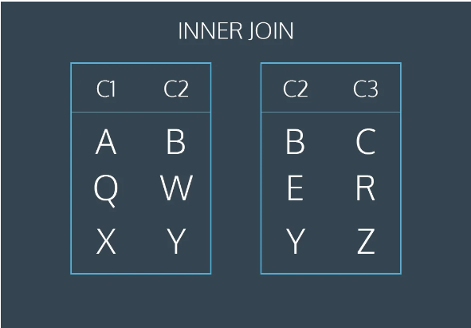
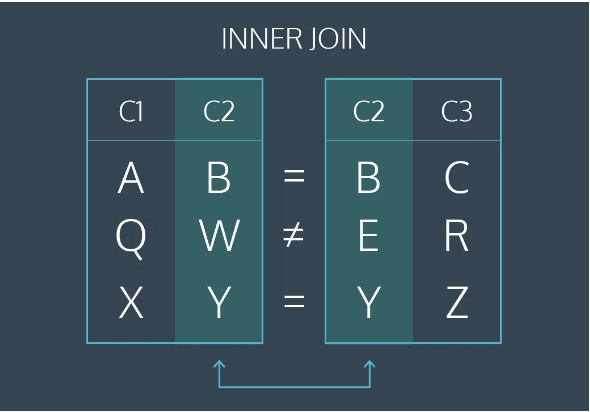
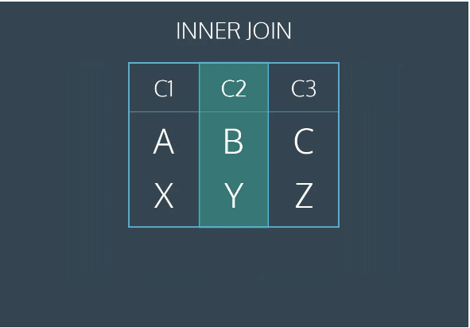
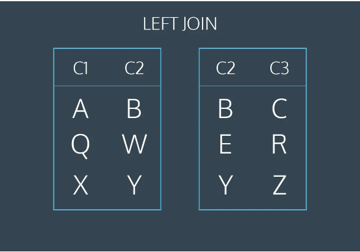
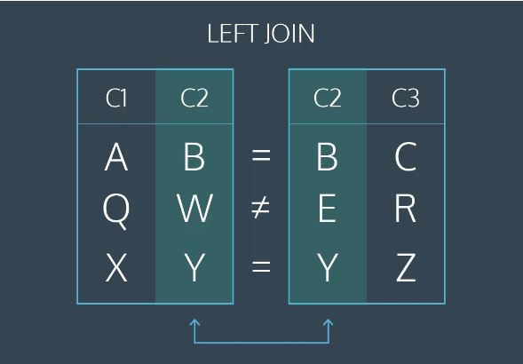
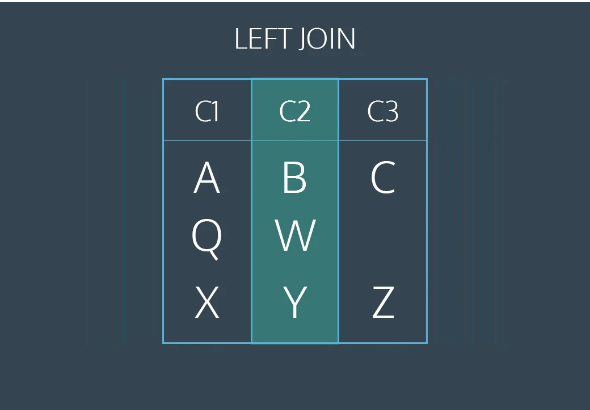

# SQL Practice

## Preface
I already know a lot of SQL so this will just be a good place to take notes for things I'd like to remember.

## Beginner Notes
SQL - Structured Query Language

```CREATE TABLE``` - creates a new table

```INSERT INTO``` - adds a new row to a table

```SELECT``` - queries data from a table

```ALTER TABLE``` - changes an existing table

```UPDATE``` - edits a row in a table

```DELETE FROM``` - deletes row from a table

## Queries

You can seperate columns in a query by using a comma like so:
```
SELECT column1, column2
FROM table_name;
```
### Aliasing
You can alias column names by doing this:
```
SELECT name AS 'Titles'
FROM movies;
```
The keyword AS renames the column in the table but not in the database. Although it isn't always necessary , it is best practices to surround your aliases with single quotes.

### Distinct
Used to return unique values in the output. It filters out all duplicate values in the specified columns. EX:
```
SELECT DISTINCT tools
FROM inventory;
```
### Where
Filters the result set to only include the rows where the follwoing condition is true. Comparison operators used with the ```WHERE``` clause are: ```=``` equal to, ```!=``` not equal to, ```>``` greater than, ```<``` less than, ```>=``` greater than or equal to, ```<=``` less than or equal to.

### Like
A special operator used with the ```WHERE``` clause to search for a specific pattern in a column. EX:
```
SELECT *
FROM movies
WHERE name LIKE 'Se_en';
```
The ```_``` means that you can substitue any individual character here without breaking the pattern.

Another useful character to use with ```LIKE``` is the percentage sign ```%```. This character matches zero or more missing letter in the pattern. As an example: ```A%``` matches all movies with names tha begin with the letter "A". Alternatively, ```%a``` matches all names that end with "a". You can also use it before and after the pattern such as ```%man%```.

### Is Null
We must use ```IS NULL``` or ```IS NOT NULL``` to check for NULL values.

### Between
Filters results within a certain range. Accepts two values which can be numbers, text, or dates. The second value is inlcusive but does not go past that value. For example:
```
SELECT * 
FROM movies
WHERE name BETWEEN 'A' AND 'J';
```
The results will include titles that are just "J" but not any movies that have full names that begin with "J".

### And
Used to combine conditions, both conditions must be true for the result to be part of the dataset. EX:
```
SELECT *
FROM movies
WHERE year BETWEEN 1990 AND 1999
  AND genre = 'romance';
```

### Or
Similar to ```AND``` the ```OR``` keyword is used with the ```WHERE``` keyword. It displays rows if any of the conditions are met. Ex:
```
SELECT *
FROM movies
WHERE year > 2014
  OR genre = 'action';
```

### Order By

This allows you to sort the dataset either alphabetically or numerically. Used with ```ASC``` (low to high or A to Z) and ```DESC``` (high to low or Z to A) Ex:
```
SELECT *
FROM movies
WHERE imdb_rating > 8
ORDER BY year DESC;
```

### Limit

Lets you specify the maximum number of rows the result set will have. ```LIMIT``` always goes at the end of the query and isn't supported by all SQL databases. Ex:
```
SELECT * 
FROM movies
LIMIT 10;
```
### Case

A ```CASE``` statement allows us to create different outputs (usually in the ```SELECT``` statement). It is also where we will use SQL's if then logic. EX:
```
SELECT name, 
  CASE 
    WHEN imdb_rating > 8 THEN 'Fantastic'
    WHEN imdb_rating > 6 THEN 'Poorly recieved'
    ELSE 'Avoid at all costs'
  END AS 'Review'
FROM movies;
```
Each ```WHEN``` tests a condtion and the following ```THEN``` gives us the string if the condition is true. The ```ELSE``` gies us the string if all the above donistions are false. The ```CASE``` statement must end with ```END  ```. We alias the column name to shorten it using ```AS```.

## Review of Queries

* ```SELECT``` is the clause we use every time we want to query information from the database.
* ```AS``` renames a column or table.
* ```DISTINCT``` return unique values.
* ```WHERE``` is a populer command that lets you filter the results of the query based on conditions that you specify.
* ```LIKE``` and ```BETWEEN``` are special operators.
* ```AND``` and ```OR``` combine multiple conditions.
* ```ORDER BY``` sorts the result.
* ```LIMIT``` specifies the maximum number of rows that the query will return.
* ```CASE``` creates different outputs.

## Aggregate Functions

* ```COUNT()``` - count the number of rows
* ```SUM()``` - the sum of the values in a column
* ```MAX()```/ ```MIN()``` - the largest/ smallest value
* ```AVG()``` - the average of the values in a column
* ```ROUND()``` - round the values in a the column

### Count

Takes the name of the column as an argument and counts the number of non-empty values in that column. Ex:
```
SELECT COUNT(*)
FROM table_name;
```
This will count every row since we passed ```*``` as an argument inside the paranthesis.

### Sum

Takes the name of a column as an argument and returns the sum of all values in that column. Ex:
```
SELECT SUM(downloads)
FROM fake_apps;
```
This adds all values in the downloads column.

### Max / Min

Functions that return the highest and lowest values in a column. Ex:
```
SELECT MAX(downloads)
FROM fake_apps;
```

### Average

Takes the column name as argument and returns the average value of that column.
Ex:
```
SELECT AVG(downloads)
FROM fake_apps;
```

### Round

Takes two arguments inside the paranthesis:
* A column name 
* An integer

It rounds the values in the column to the number of decimal places specified by the integer. Ex:
```
SELECT ROUND(price, 0)
FROM fake_apps;
```
### Group By

```GROUP BY``` is a clause in SQL that i used with aggregate functions. It is used in collaboration with the ```SELECT``` statement to arrange identical data into groups. Ex: We start with this
```
SELECT AVG(imdb_rating)
FROM movies
WHERE year = 1999;

SELECT AVG(imdb_rating)
FROM movies
WHERE year = 2000;

SELECT AVG(imdb_rating)
FROM movies 
WHERE year = 2001;
```
And it can become this using ```GROUP BY```.
```
SELECT year,
  AVG(imdb_rating)
FROM movies
GROUP BY year
ORDER BY year;
```
The ```GROUP BY``` statement comes after any ```WHERE``` statements, but before ```ORDER BY``` or ```LIMIT```.

Sometimes we want to group by a calculation done on a column. Ex:
```
SELECT ROUND(imdb_rating),
  COUNT(name)
FROM movies 
GROUP BY ROUND(imdb_rating)
ORDER BY ROUND(imdb_rating);
```
You can make this less time consuming by using column reference numbers. 
```
SELECT ROUND(imdb_rating),
  COUNT(name)
FROM movies
GROUP BY 1
ORDER BY 1;
```
Where 1 is the first column selected, 2 the second, and so on.

### Having

* When we want to limit results of a query based on values of the individual rows, use ```WHERE```.
* When we want to limit the results of a query based on an aggregate property, use ```HAVING```.

EX:
```
SELECT year,
  genre,
  COUNT(name)
FROM movies
GROUP BY 1, 2
HAVING COUNT(name) > 10;
```
```HAVING``` statements always come after ```GROUP BY``` but before ```ORDER BY``` and ```LIMIT```.

### Review

* ```COUNT()``` - count the number of rows
* ```SUM()``` - the sum of the values in a column
* ```MAX()```/ ```MIN()``` - the largest/ smallest value
* ```AVG()``` - the average of the values in a column
* ```ROUND()``` - round the values in a the column
* ```GROUP BY``` - a clause used with aggregate functions to combine data from one or more columns
* ```HAVING``` - limit the results of a query based on an aggregate property


## Multiple Tables

### Join

There will be more information on these as they get more complex. Ex:
```
SELECT *
FROM orders
JOIN customers
  ON orders.customer_id = customers.customer_id;
```
```WHERE``` clause goes after the ```JOIN```. Ex:
```
SELECT *
FROM orders
JOIN subscriptions
  ON orders.subscription_id = subscriptions.subscription_id
WHERE subscriptions.description = 'Fashion Magazine';
```
This query will only select rows from the join where the ```description``` is equal to 'Fashion Magazine'.

## Inner Join

When we perform a simple ```JOIN``` (often called an _inner join_) our result only includes rows that match our ```ON``` condition. The next few images show an inner join on two tables on ```table1.c2 = table2.c2```.





The first and last rows have matching values of ```c2```. The middle rows do not match. The final reulst has values from the first and last rows but does not include the non-matching middle row.

### Left Join

A ```LEFT JOIN``` willkeep all rows from the first table, regardless of whether there is a matching row in the second table. In the images below, the first and last rows have matching values for ```c2```. The middle rows do not match. The final result will keep all rows of the first table but will omit the un-matched row from the second table.





The images represent a table operation produced by the follwing command:
```
SELECT *
FROM table1
LEFT JOIN table2
  ON table1.c2 = table2.c2;
```

### Primary and Foreign Keys

Primary keys:
* None of the values can be null.
* Each value must be unique (i.e. you cant have two customers with the same ```customer_id``` in the ```customers``` table).
* A table can not have more tha one primary key column.

When the primary key for one table appears in a different table, it is called a foreign key.

### Cross Join
Sometimes we want to combine all rows of one table with all rows o another table. For instance, if we had a table of shirts and a table of pants, we might want to know all the possible combinations to create different outfits. Ex:
```
SELECT shirts.shirt_color,
  pants.pants_color
FROM shirts
CROSS JOIN pants;
```
The first two lines select the columns ```shirt_color``` and ```pants_color```. The third line pulls data from the table shirts. The fourth line performs a ```CROSS JOIN``` with pants. Notice that cross joins dont require an ```ON``` statement. This is a fairly impractical excample, a more common usage is when we need to compare each row of a table to a list of values.

### Union
SOmetimes we just want to stack one dataset on top of another, fo rthat we use ```UNION```. Ex:
```
SELECT * 
FROM table1
UNION
SELECT *
FROM table2;
```
The tables must have the same number of columns and the columns must have the same datat types in the same order as the first table.

### With

The ```WITH``` statement allows us to perform a seperate query (such as aggregating customer's subscriptions). Ex:
```
WITH previous_results AS (
  SELECT ...
  ...
  ...
  ...
)
SELECT *
FROM previous_results
JOIN customers
  ON _____ = _____;
```
```previous_results``` is the alias that we will use to reference any columns from the query inside of the ```WITH``` clause. WE can then go on to do whatever we want with this temporary table (such as join the temporary table with another table). Essentially, we are putting a whole first query inside the parantheses and giving it a name. After that, we can use this name as if it's a table and write a new query using the first query.

### Review
* ```JOIN ``` will combine rows from different tables if the join condition is true.
* ```LEFT JOIN``` will return every row in the left table, and if the join condition is not met, ```NULL``` values are used to fill in the columns from the right table.
* Primary key is a column that serves a unique identifier for the rows in the table.
* Foreign key is a column that contains the primary key to another table.
* ```CROSS JOIN``` lets us combine all rows of one table with all rows of another table.
* ```UNION``` stacks one dataset on top of another.
* ```WITH``` allows us to define one or more temporary tables that can be used in the final query.
